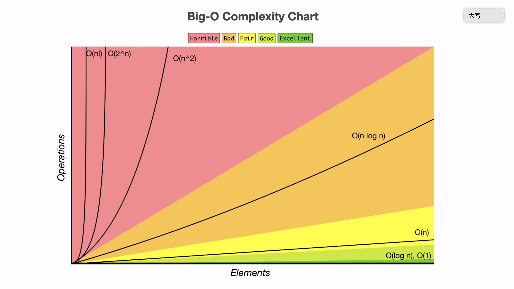
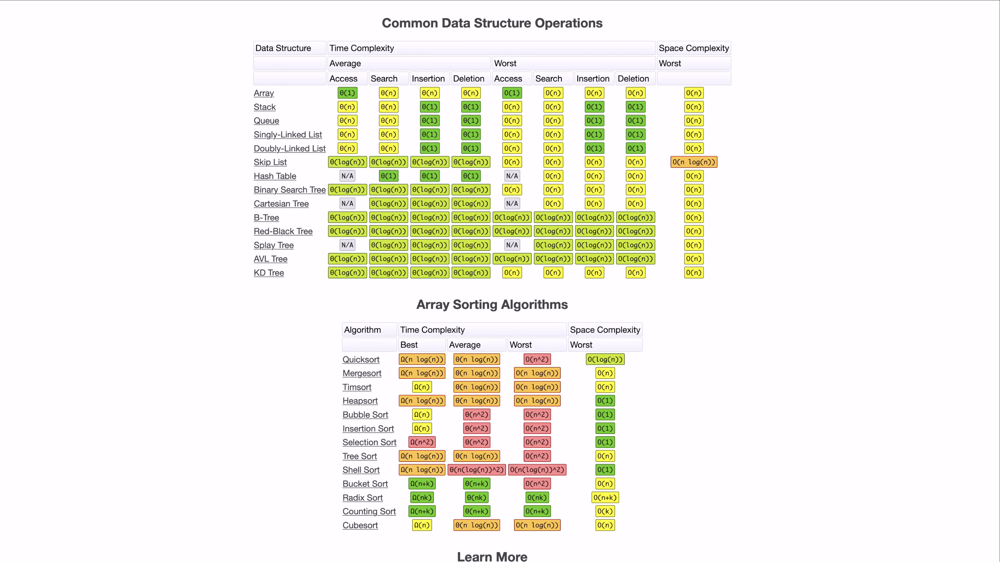

# data-structure-ts
Hash (CoordinateSet, CoordinateMap) Heap (MaxHeap, MinHeap) Binary Tree (AVL Tree, Binary Indexed Tree, Binary Search Tree, Segment Tree, Tree Multiset) Graph (Directed Graph, Undirected Graph) Linked List (Singly Linked List, Doubly Linked List) Matrix Priority Queue (Max Priority Queue, Min Priority Queue) Queue (Queue, Dequeue) Stack Trie

