# data-structure-typed

Javascript Data Structure, TypeScript Data Structure Library

## install

### yarn

```bash
yarn add data-structure-typed
```

### npm

```bash
npm install data-structure-typed
```

## data structures

Meticulously crafted to empower developers with a versatile set of essential data structures. Our library includes a wide range of data structures:
Binary Tree, Binary Search Tree (BST), AVL Tree, Tree Multiset, Segment Tree, Binary Indexed Tree, Graph, Directed Graph, Undirected Graph, Linked List, Singly Linked List, Doubly Linked List, Queue, Object Deque, Array Deque, Stack, Hash, Coordinate Set, Coordinate Map, Heap, Priority Queue, Max Priority Queue, Min Priority Queue, Trie
<table>
<thead>
  <tr>
    <th>Data Structure</th>
    <th>Derived</th>
    <th>Basic Features</th>
    <th>Additional Features</th>
  </tr>
</thead>

<tbody>
<tr>
    <td>Binary Tree</td>
    <td>AVL Tree, Binary Search Tree, Tree Multiset</td>
    <td>put, has, get, remove, size, insertTo, insertMany, fill, getDepth, getHeight, getMinHeight, getPathToRoot, isBalanced </td>
    <td>getLeftMost, isBST, getSubTreeSizeAndCount, subTreeSum, subTreeAdd, BFS, DFS, DFSIterative, levelIterative, listLevels, getPredecessor, morris,  </td>
  </tr>

  <tr>
    <td>AVL Tree</td>
    <td></td>
    <td>All the features inherited from Binary Tree, balanceFactor, updateHeight, balancePath, balanceLL, balanceLR, balanceRR, balanceRL</td>
    <td></td>
  </tr>

  <tr>
    <td>Binary Search Tree (BST)</td>
    <td></td>
    <td>All the features inherited from Binary Tree, lastKey</td>
    <td>All the features inherited from Binary Tree, lesserSum, allGreaterNodesAdd, balance, isAVLBalanced</td>
  </tr>

  <tr>
    <td>Tree Multiset</td>
    <td></td>
    <td>All the features inherited from Binary Tree</td>
    <td>All the features inherited from Binary Tree</td>
  </tr>

  <tr>
    <td>Segment Tree</td>
    <td></td>
    <td>build, updateNode, querySumByRange</td>
    <td></td>
  </tr>

  <tr>
    <td>Binary Indexed Tree</td>
    <td></td>
    <td>update, getPrefixSum, getRangeSum, BinaryIndexedTree.lowBit</td>
    <td></td>
  </tr>
  <tr>
    <td>Graph</td>
    <td>Directed Graph, Undirected Graph</td>
    <td>getVertex, getVertexId, containsVertex, vertexSet, addVertex, removeVertex, removeAllVertices, containsEdge, setEdgeWeight, getAllPathsBetween, getPathSumWeight, getMinCostBetween, getMinPathBetween, </td>
    <td>dijkstra, dijkstraWithoutHeap, bellmanFord, floyd, tarjan</td>
  </tr>
  <tr>
    <td>Directed Graph</td>
    <td></td>
    <td>All the features inherited from Graph, getEdge, addEdge, removeEdgeBetween, removeEdge, removeAllEdges, incomingEdgesOf, outgoingEdgesOf, degreeOf, inDegreeOf, outDegreeOf, edgesOf, getEdgeSrc, getEdgeDest, getDestinations, edgeSet, getNeighbors, getEndsOfEdge</td>
    <td>All the features inherited from Graph, topologicalSort</td>
  </tr>
  <tr>
    <td>Undirected Graph</td>
    <td></td>
    <td>All the features inherited from Graph, getEdge, addEdge, removeEdgeBetween, removeEdge, degreeOf, edgesOf, edgeSet, getEdgesOf, getNeighbors, getEndsOfEdge</td>
    <td>All the features inherited from Graph</td>
  </tr>
  <tr>
    <td>Singly Linked List</td>
    <td></td>
    <td>length, head, tail, size, get, getNode, findNodeIndex, findNode, find, findIndex, append, push, prepend, insertAt, removeNode, removeAt, insertBefore, sort, insertAfter, shift, pop, merge, clear, slice, reverse, forEach, map, filter, reduce, toArray, toString</td>
    <td></td>

  </tr>
  <tr>
    <td>Hash</td>
    <td>CoordinateSet, CoordinateMap</td>
    <td></td>
    <td></td>
  </tr>
  <tr>
    <td>CoordinateSet</td>
    <td></td>
    <td>has, set, get, delete</td>
    <td></td>
  </tr>
  <tr>
    <td>CoordinateMap</td>
    <td></td>
    <td>has, add, delete</td>
    <td></td>
  </tr>
  <tr>
    <td>Heap</td>
    <td></td>
    <td></td>
  </tr>


  <tr>
    <td>Doubly Linked List</td>
    <td></td>
    <td>size, offerFirst, offerLast, peekFirst, peekLast, pollFirst, pollLast, get, isEmpty, insert, remove, </td>
    <td></td>
  </tr>

[//]: # (  <tr>)

[//]: # (    <td>Matrix</td>)

[//]: # (    <td></td>)

[//]: # (    <td></td>)

[//]: # (    <td></td>)

[//]: # (  </tr>)

  <tr>
    <td>Priority Queue</td>
    <td>Max Priority Queue, Min Priority Queue</td>
    <td>offer, peek, poll, leaf, isEmpty, clear, toArray, clone</td>
    <td>isValid, sort, DFS</td>
  </tr>
  <tr>
    <td>Max Priority Queue</td>
    <td></td>
    <td>All the features inherited from Priority Queue</td>
    <td>All the features inherited from Priority Queue</td>
  </tr>
  <tr>
    <td>Min Priority Queue</td>
    <td></td>
    <td>All the features inherited from Priority Queue</td>
    <td>All the features inherited from Priority Queue</td>
  </tr>
  <tr>
    <td>Queue</td>
    <td>Queue, Dequeue</td>
    <td>offer, poll, peek, peekLast, size, isEmpty, toArray, clear, clone, Queue.fromArray</td>
    <td></td>
  </tr>
  <tr>
    <td>ObjectDeque</td>
    <td></td>
    <td>size, offerFirst, offerLast, pollFirst, peekFirst, pollLast, peekLast, get, isEmpty</td>
    <td></td>
  </tr>
  <tr>
    <td>ArrayDeque</td>
    <td></td>
    <td>offerLast, pollLast, pollFirst, offerFirst, peekFirst, peekLast, get, set, insert, remove, isEmpty</td>
    <td></td>
  </tr>
  <tr>
    <td>Stack</td>
    <td></td>
    <td>isEmpty, size, peek, push, pop, toArray, clear, clone, Stack.fromArray</td>
    <td></td>
  </tr>
  <tr>
    <td>Trie</td>
    <td></td>
    <td>put, has, remove, isAbsPrefix, isPrefix, getAll</td>
    <td></td>
  </tr>
</tbody>

</table>


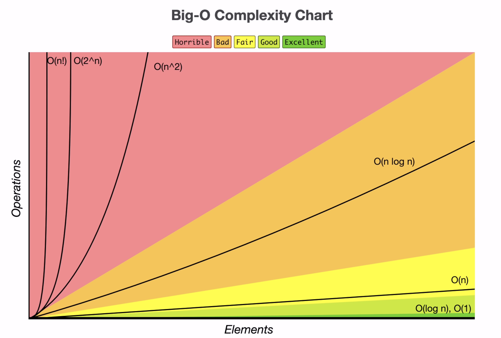

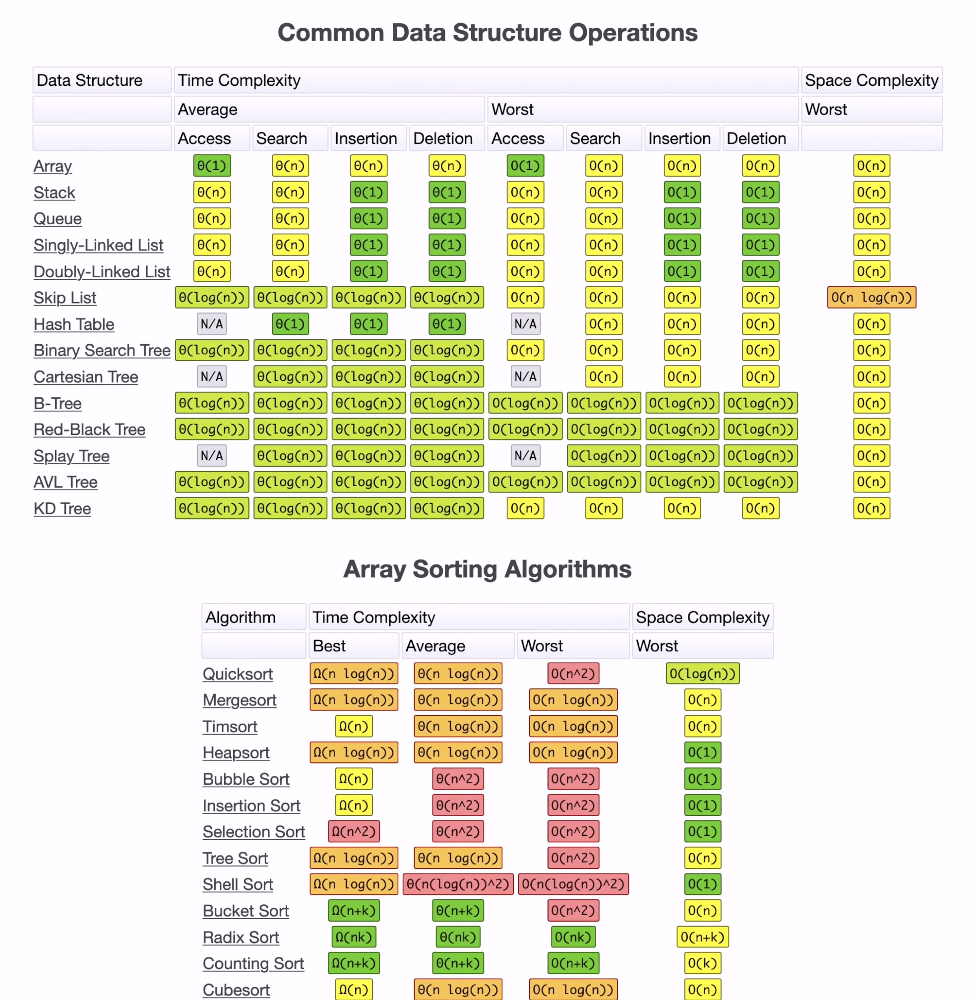


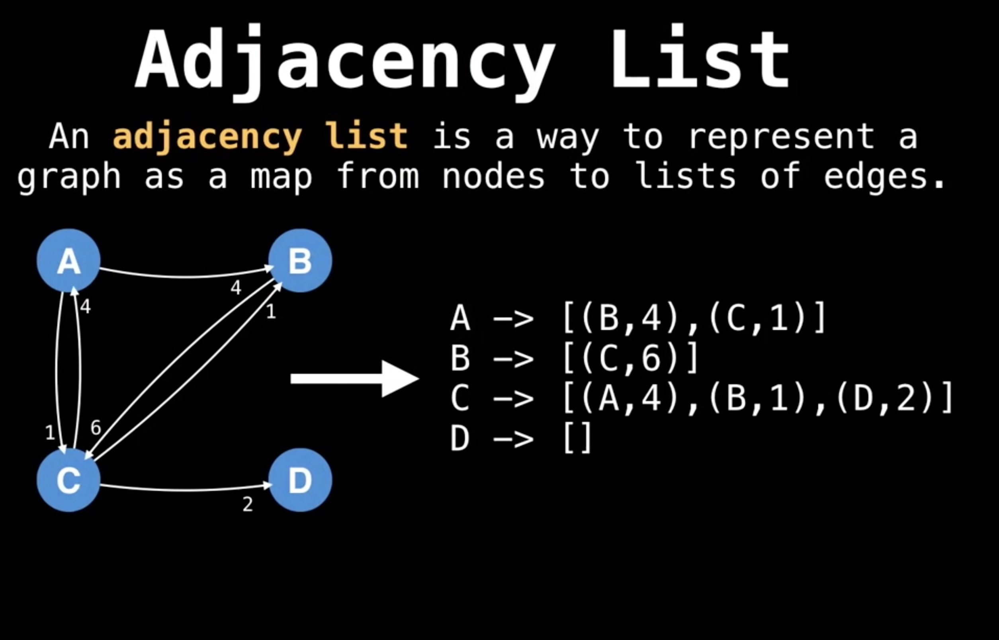

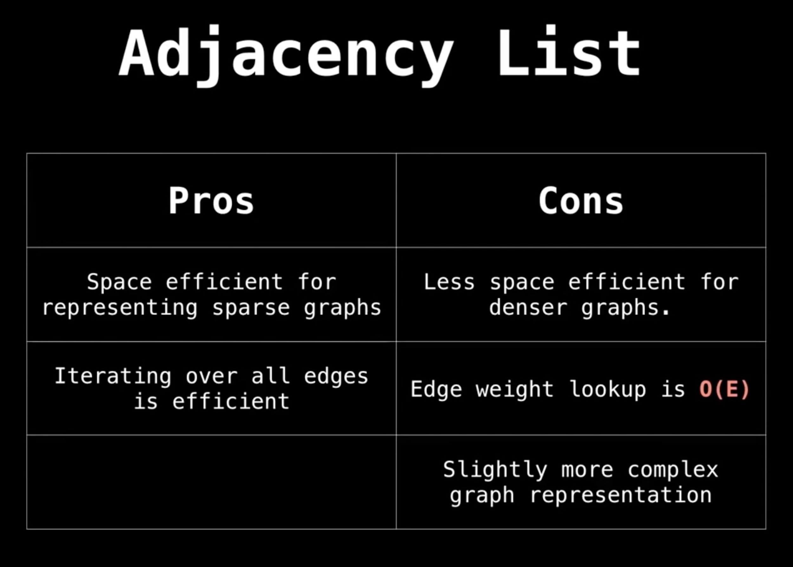

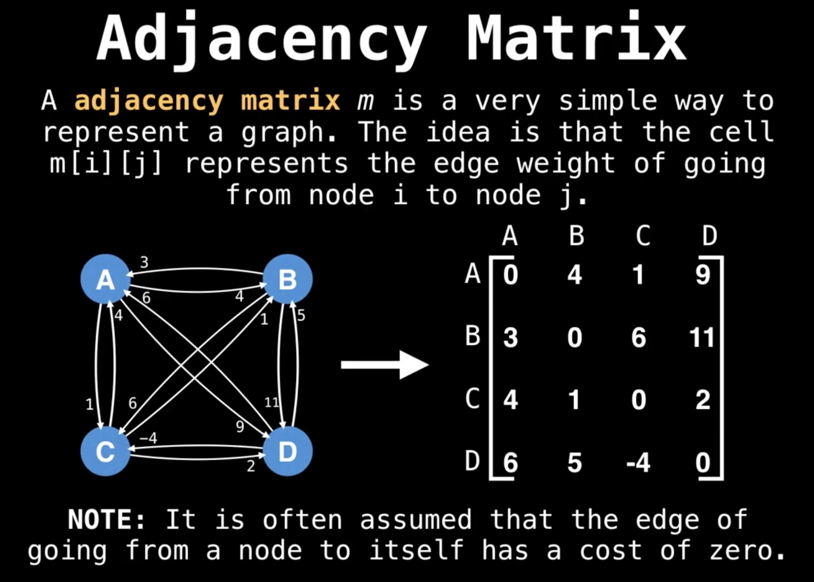

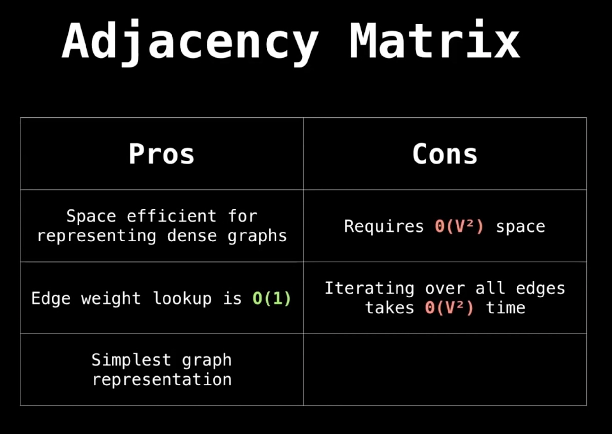

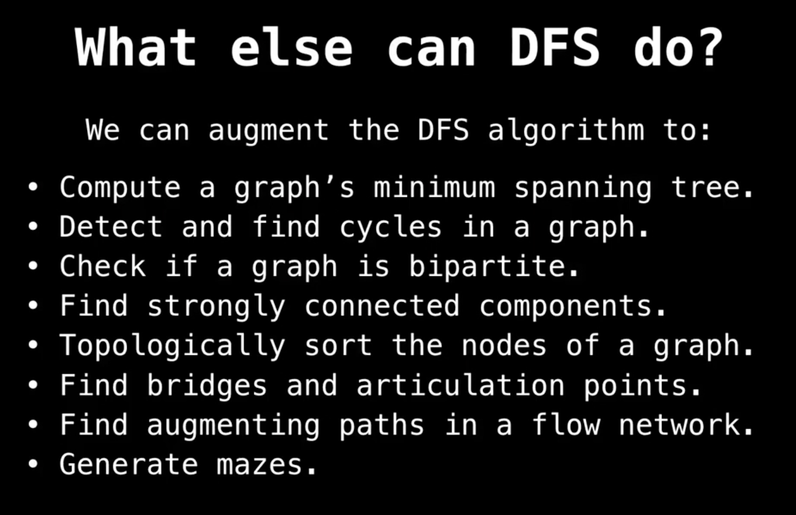

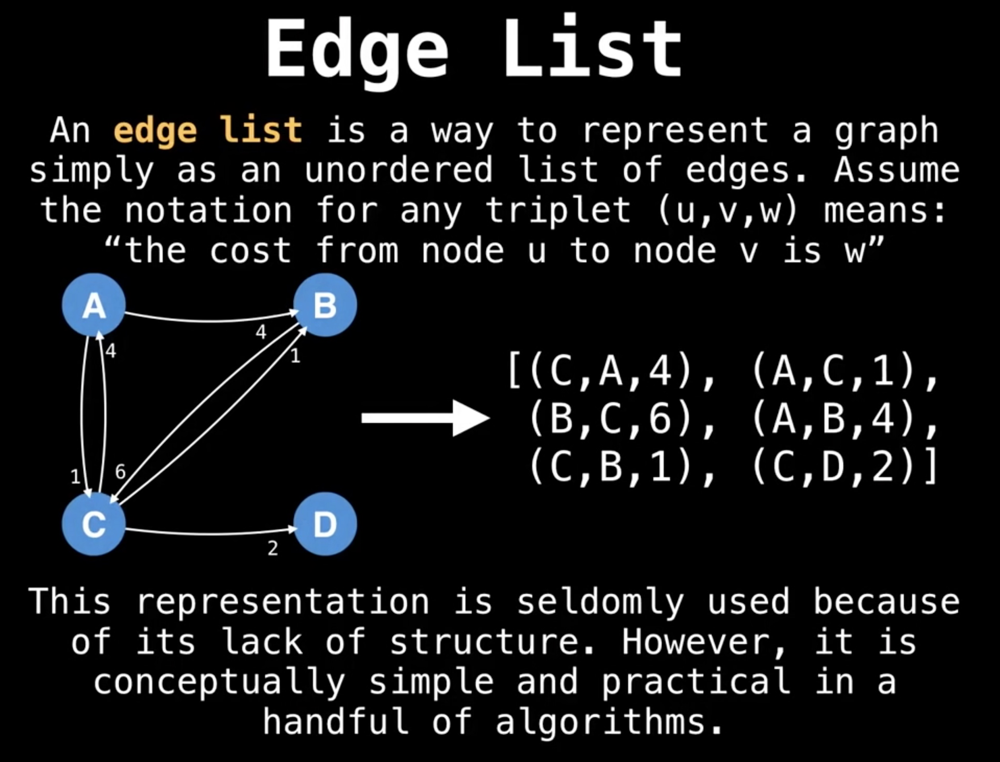

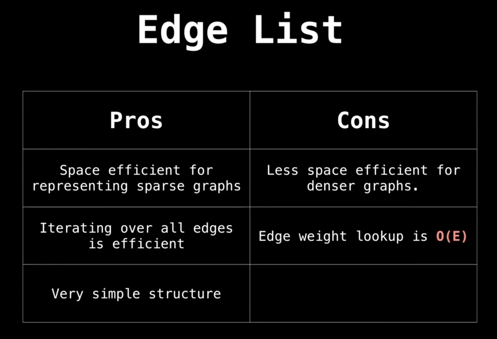

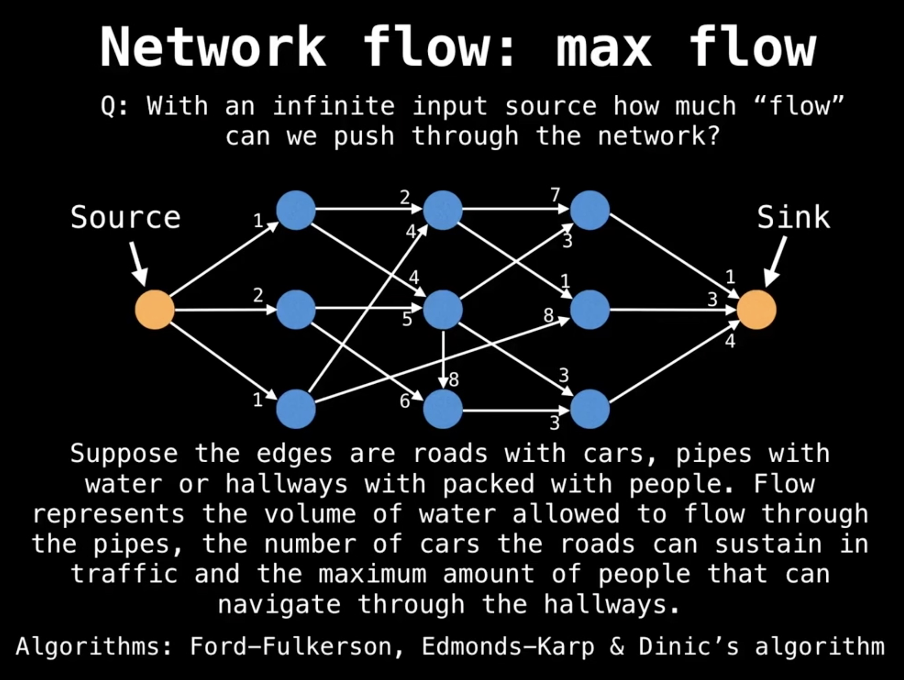

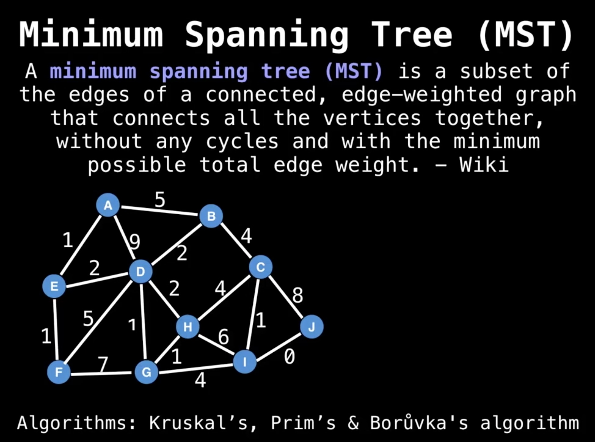

[//]: # (![]&#40;src/data-structures/graph/diagrams/tarjan-articulation-point-bridge.png&#41;)

[//]: # (![]&#40;src/data-structures/graph/diagrams/tarjan-complicate-simple.png&#41;)

[//]: # (![]&#40;src/data-structures/graph/diagrams/tarjan-strongly-connected-component.png&#41;)


